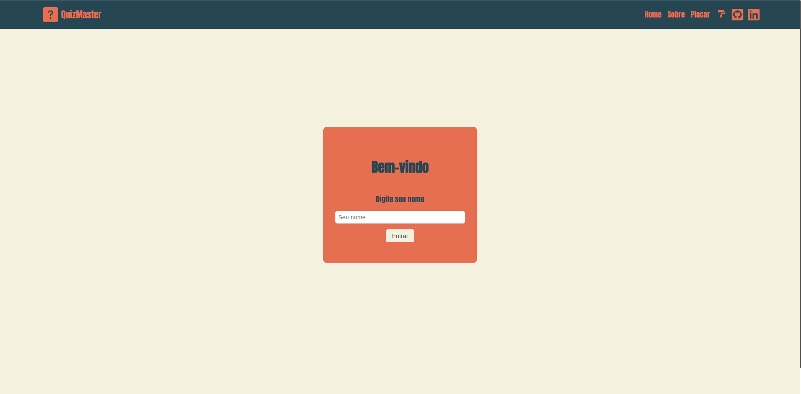
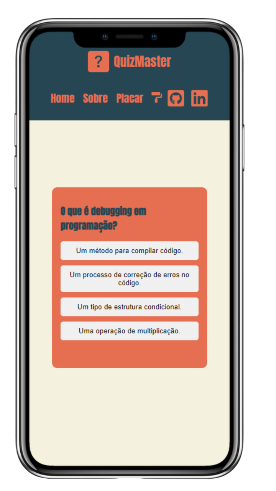

# Quiz Master

Quiz Master é um aplicativo de quiz interativo desenvolvido em React com Vite que permite aos usuários testarem seus conhecimentos respondendo a uma série de perguntas. Este projeto foi concebido com o objetivo de fornecer uma experiência de teste de conhecimentos e servir como protótipo para projetos de gamificação mais complexos.

### Objetivo

O objetivo principal do Quiz Master é servir como uma base para entender o funcionamento de projetos e a lógica por trás dos processos envolvidos. Nele, várias tecnologias são empregadas, como consumo de uma API criada usando Node.js, Express e MongoDB, adaptada para atender às necessidades básicas da interface.

Seja bem-vindo ao Quiz Master e divirta-se desafiando seus conhecimentos!

[Teste Aqui](https://quiz-master-react.vercel.app/).

## Capturas de Tela

Aqui estão algumas capturas de tela do Quiz Master:

### Tela Inicial PC 



### Exemplo de Pergunta Mobile



## Tecnologias Utilizadas

O Quiz Master utiliza as seguintes tecnologias e ferramentas:

- React
- Vite
- Styled Components
- React Router

## Instalação

Para executar o Quiz Master localmente, siga as instruções abaixo:

1. Clone o repositório:

```bash
git clone https://github.com/Thiagof2755/QuizMaster-React.git
```

2. Navegue até o diretório do projeto:

```bash
cd quiz-master
```

3. Instale as dependências:

```bash
npm install
```

## Como Usar

Para iniciar o servidor local e executar o Quiz Master, execute o seguinte comando:

```bash
npm start
```

Isso iniciará o aplicativo em seu navegador padrão. Você pode então começar a responder às perguntas do quiz.

## API Personalizada

O Quiz Master consome uma API personalizada para obter as perguntas do quiz. Você pode encontrar mais informações sobre como configurar e usar esta API [AQUI](https://github.com/Thiagof2755/QuizMaster-API-NodeJS).

## Contribuindo

Se você quiser contribuir com o Quiz Master, siga estas etapas:

1. Abra uma issue para discutir a mudança que você gostaria de fazer.
2. Faça um fork do repositório e crie um branch para sua contribuição.
3. Envie suas alterações com um pull request.

## Licença

Este projeto está licenciado sob a [MIT License](LICENSE).

